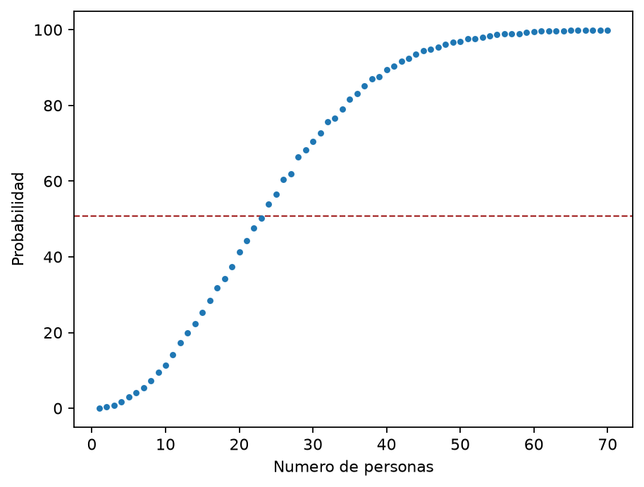

# El problema del cumpleaños

La paradoja del cumpleaños es un problema clásico de estadística y un buen ejemplo de cómo nuestra intuición puede fallar cuando intervienen muchas combinaciones posibles.

La pregunta es sencilla: ¿cuántas personas deben reunirse para que sea más probable que al menos dos cumplan años el mismo día?

La respuesta es **23 personas**. Aunque pueda parecer un grupo pequeño, con 23 personas existen

$$
\binom{23}{2}=253
$$

pares posibles que podrían compartir cumpleaños.

  

La línea punteada marca aproximadamente el $50.7\%$, probabilidad alcanzada por un grupo de 23 personas. Los puntos muestran el resultado de la simulación, realizada con 10 000 grupos aleatorios para cada tamaño entre 1 y 70 personas.

## Cálculo de la probabilidad

Es más sencillo calcular primero la probabilidad de que **nadie** comparta cumpleaños. Para un grupo de $n$ personas:

$$
P(\text{todos distintos})
=\frac{365}{365}\cdot\frac{364}{365}\cdot\frac{363}{365}\cdots\frac{365-n+1}{365}
=\frac{365!}{(365-n)!\,365^n}.
$$

Por complemento, la probabilidad de que al menos dos personas coincidan es

$$
P(\text{alguna coincidencia})
=1-P(\text{todos distintos}).
$$

Para $n=23$:

$$
P(\text{alguna coincidencia})\approx0.5073.
$$

El resultado supone 365 días igualmente probables, cumpleaños independientes y excluye el 29 de febrero. La llamada “paradoja” no es una contradicción: lo sorprendente es que solemos comparar cada cumpleaños con uno solo, en lugar de considerar todos los pares posibles del grupo.
